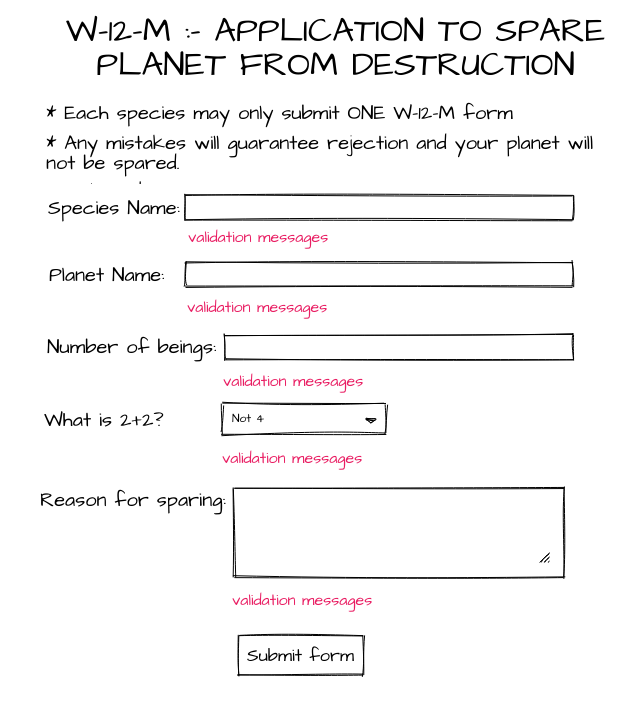

# Testing React Components

Terrible news! Aliens have invaded the Earth. 👽 👾 👽 👾 👽 👾 

Luckily, their species is _incredibly_ bureaucratic 📝 

The aliens have promised to spare the Earth if we can submit form W-12-M without making a single mistake. You've been chosen for your skills at testing React components to ensure we cannot get it wrong.

## This Exercise

This is a challenging exercise. You'll build a simple version of the above form, write tests to make sure it works, then add validation to the fields, and then write more tests to ensure the validation works. Finally there are some extensions to push you even further!

But don't be afraid - not even of the aliens. There are some extra hints available if you get stuck, and if you get super stuck you can always reach out to us on Slack and we'll help you get going again.

🌍 🌍 🌍

Let's save humanity. 

🌍 🌍 🌍

## Useful Links

You might find some of the documentation helpful in writing your tests:

[Testing Library Cheatsheet](https://testing-library.com/docs/react-testing-library/cheatsheet/)
[Jest-DOM matchers](https://github.com/testing-library/jest-dom)
[Jest Mock functions](https://jestjs.io/docs/mock-functions)

## How to Get Started

This repo contains the beginnings of an app, based on create-react-app.

Fork this repo to your Github and then clone the forked version of this repo.

To install the dependencies run:

### `yarn install`

or

### `npm install`

(They both do the same thing)

Make sure you're in the right directory!

To start the app:

### `yarn start`

or

### `npm start`

Runs the app in the development mode.

The app should open in your browser.

If the page doesn't open automatically, you can open [http://localhost:3000](http://localhost:3000) to view it in the browser.

The page will reload if you make edits 👍

You will also see any lint errors in the console ✅

Head over to [Activity 1](./activities/activity-1.md) to get started!
